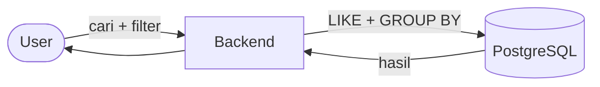
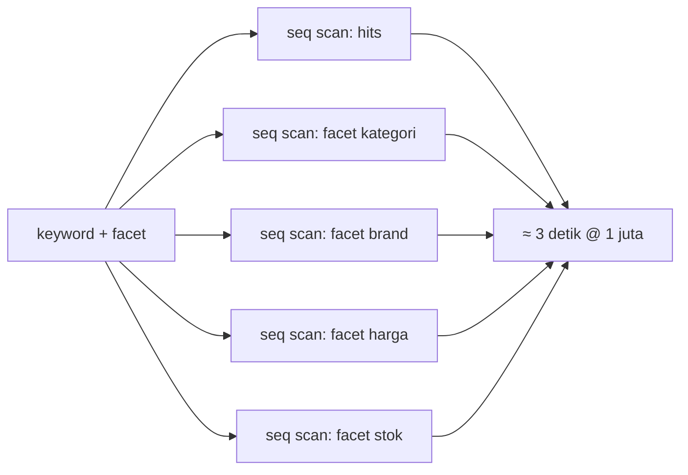
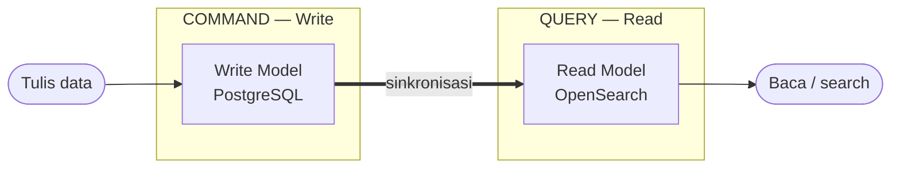
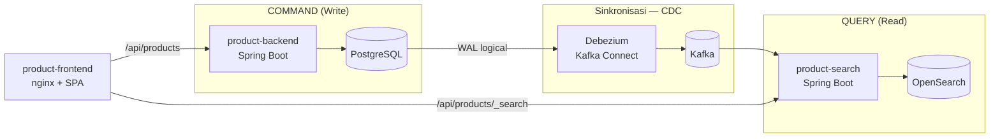
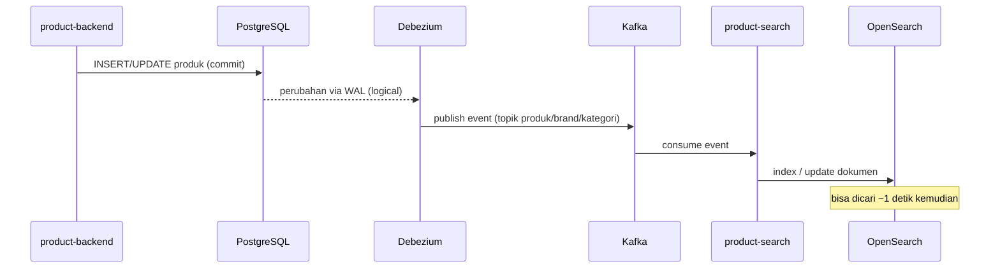
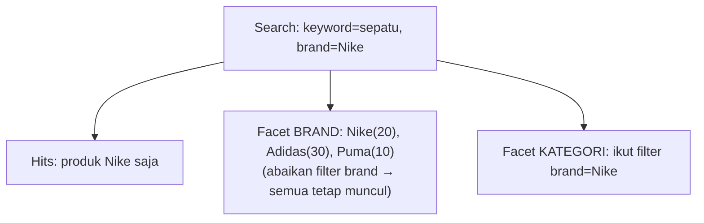
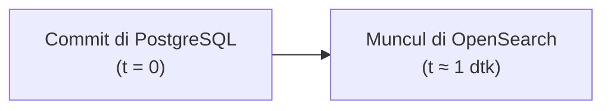
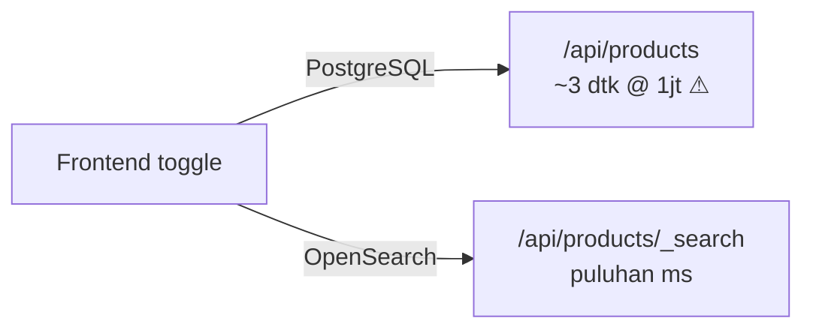

# SLIDE — CQRS untuk Product Search

> **Catatan untuk pembuat slide (Claude Design):** File ini adalah materi sumber.
> Setiap bagian dipisah `---` = satu slide. `##` = judul slide. Bullet = poin di
> slide. Blok `> Narasi:` = catatan pembicara (boleh tidak ditampilkan). Blok
> ```mermaid``` = diagram yang sebaiknya dirender visual. Bahasa: Indonesia,
> istilah teknis dibiarkan dalam Bahasa Inggris.

---

## CQRS untuk Product Search

### Dari PostgreSQL yang lambat → OpenSearch yang cepat

Sebuah studi kasus nyata: pencarian katalog produk e-commerce

> Narasi: Kita akan mulai dari sebuah masalah sederhana yang dialami banyak tim,
> lalu pelan-pelan sampai ke solusi CQRS — dan mendemokannya langsung.

---

## Konteks: Pencarian Katalog Produk

- Aplikasi punya **katalog produk** (produk, kategori, brand).
- User mengharapkan pencarian ala toko online:
  - **Keyword search** ("sepatu", "wireless mouse")
  - **Filter**: kategori, brand, rentang harga, ketersediaan stok
  - **Facet**: jumlah produk di tiap pilihan filter (Nike (20), Adidas (30)…)
  - **Sorting** & **pagination**
- Data awalnya sedikit → semua terasa cepat.

> Narasi: Di awal proyek, semua fitur ini gampang dibuat dengan satu database.
> Masalah baru muncul saat data membesar.

---

## Pendekatan Awal: Satu Database Saja



- **Write & read** dilayani **PostgreSQL** yang sama.
- Keyword: `WHERE LOWER(name) LIKE '%kata%' OR LOWER(description) LIKE '%kata%'`
- Facet: beberapa query `GROUP BY` (per kategori, brand, harga, stok).

> Narasi: Arsitektur paling sederhana dan paling umum. Tidak ada yang salah —
> sampai datanya jadi jutaan baris.

---

## Masalah: Lambat di Skala Besar

Hasil pengukuran nyata (waktu proses query di backend):

| Jumlah produk | Keyword search + facet |
|---------------|------------------------|
| 100.000       | ~0,3 detik             |
| **1.000.000** | **~3,2 detik** 🐌      |

- Di 1 juta data, satu pencarian bisa **~3 detik**.
- Makin banyak data → makin lambat (mendekati linear, lalu memburuk).

> Narasi: Tiga detik untuk satu kali ketik pencarian itu fatal untuk UX. Dan ini
> baru 1 juta — bayangkan 10 juta.

---

## Kenapa Bisa Selambat Itu?

- **`LIKE '%kata%'` (leading wildcard)** → index **tidak bisa dipakai** →
  **sequential scan** seluruh tabel.
- **Facet** = beberapa query agregasi `GROUP BY`, **masing-masing full-scan**.
- Biaya ≈ **(jumlah query facet) × (scan seluruh baris)**.



> Narasi: Database OLTP (PostgreSQL) dioptimalkan untuk transaksi tulis yang
> ternormalisasi — bukan untuk full-text search + agregasi berat. Kita memakai
> alat yang salah untuk pekerjaan ini.

---

## Akar Masalah: Satu Model untuk Dua Kebutuhan

- **Write** butuh: normalisasi, konsistensi, transaksi (OLTP).
- **Read/Search** butuh: full-text, agregasi facet, kecepatan baca.
- Keduanya **tarik-menarik** dalam satu model data yang sama.

> Optimasi untuk write ≠ optimasi untuk read.

> Narasi: Ini insight kuncinya. Selama write dan read berbagi satu model, kita
> selalu berkompromi. Solusinya: pisahkan keduanya.

---

## Solusi: CQRS

**C**ommand **Q**uery **R**esponsibility **S**egregation

- Pisahkan **model tulis (Command)** dari **model baca (Query)**.
- Tiap sisi dioptimalkan **independen**, pakai teknologi yang paling cocok.



> Narasi: CQRS bukan teknologi, tapi pola. Inti idenya satu kalimat: data ditulis
> ke satu model, dibaca dari model lain yang sudah dioptimalkan untuk baca.

---

## CQRS: Manfaat & Konsekuensi

**Manfaat**
- Read model bisa pakai engine khusus (search engine) → baca super cepat.
- Write model tetap bersih & ternormalisasi.
- Skala read & write bisa independen.

**Konsekuensi (trade-off)**
- **Eventual consistency**: read model menyusul write (tidak instan).
- Lebih banyak komponen → kompleksitas operasional naik.

> Narasi: Tidak ada makan siang gratis. CQRS menukar "konsistensi langsung &
> kesederhanaan" dengan "kecepatan baca & skalabilitas". Untuk fitur search,
> tukar-menukar ini hampir selalu worth it.

---

## Arsitektur Demo Kita



- **Write**: `product-backend` → PostgreSQL (sumber kebenaran).
- **Sync**: Debezium membaca perubahan → Kafka.
- **Read**: `product-search` mengonsumsi → meng-index ke OpenSearch → melayani `/_search`.
- **Frontend** bisa memilih query ke **PostgreSQL** atau **OpenSearch**.

> Narasi: Inilah peta besarnya. Tiga slide berikutnya membedah tiap bagian:
> sinkronisasi (CDC), read model (OpenSearch), dan trade-off konsistensi.

---

## Sinkronisasi via CDC (Change Data Capture)

Bagaimana data write sampai ke read model **tanpa** backend tahu soal read model?



- **Debezium** membaca **WAL** PostgreSQL (bukan polling, bukan dual-write).
- `product-backend` **tidak diubah** — tetap menulis ke PostgreSQL seperti biasa.
- Decoupling bersih: write tak peduli ada berapa read model.

> Narasi: CDC adalah "kabel" CQRS. Karena membaca WAL, ia menangkap SEMUA
> perubahan tanpa mengubah aplikasi penulis. Ini kunci pemisahan yang bersih.

---

## Read Model: Kenapa OpenSearch?

Search engine memang dirancang untuk pekerjaan ini:

- **Full-text & substring** cepat (terindeks), bukan sequential scan.
- **Facet = aggregations native** → hits + semua facet dalam **satu** query.
- **Relevansi, typo-tolerance**, skala horizontal.

| Aspek                | PostgreSQL + `LIKE` | OpenSearch          |
|----------------------|---------------------|---------------------|
| Keyword substring    | seq scan (lambat)   | terindeks (cepat)   |
| Facet + count        | banyak `GROUP BY`   | 1 query agregasi    |
| Waktu @ 1 juta       | ~3 detik            | puluhan milidetik   |

> Narasi: Kita tidak "memperbaiki" PostgreSQL — kita memberi pekerjaan search ke
> alat yang memang ahlinya, sambil PostgreSQL tetap jadi sumber kebenaran.

---

## Teknik #1: n-gram = `LIKE` tapi Cepat

Kita harus meniru perilaku `LIKE '%kata%'` (substring di mana saja).

- Field `name`/`description` di-index dengan **analyzer n-gram** (2–3 huruf).
- Query memakai **`match_phrase`** → n-gram harus berurutan → cocok substring
  **panjang berapa pun** (mirip `LIKE`), tetapi **terindeks → cepat**.
- Sama prinsipnya dengan **`pg_trgm`** (trigram) di PostgreSQL.

```
"wireless"  →  [wi, wir, ire, rel, ele, les, ess, ...]
match_phrase: n-gram harus bersebelahan  →  substring "wireless" ketemu
```

> Hasil demo: total hasil **identik** dengan `LIKE` PostgreSQL (parity terverifikasi),
> tanpa false positive — tapi jauh lebih cepat.

---

## Teknik #2: Facet Drill-Down

"Pilih satu brand, brand lain jangan hilang."

- Satu request → hits + semua facet.
- Tiap facet dihitung dengan semua filter aktif **KECUALI** filter dimensinya
  sendiri (`post_filter` + `filter` aggregation per dimensi).



> Narasi: Ini perilaku standar e-commerce. Di OpenSearch jadi satu query elegan;
> di PostgreSQL butuh banyak query terpisah.

---

## Trade-off: Eventual Consistency

- Read model **menyusul** write, tidak instan.
- Lag total ≈ Debezium + Kafka + indexing + **refresh OpenSearch (~1 dtk)**.
- Praktiknya: tulis di backend → **~1 detik** kemudian muncul di `/_search`.



- Untuk **search katalog**, lag 1 detik **sangat dapat diterima**.
- Untuk data yang butuh konsistensi kuat (mis. saldo) → tetap baca dari write model.

> Narasi: Penting jujur soal ini. CQRS = eventual consistency. Cocok untuk search,
> tidak cocok untuk semua hal. Pilih per use-case.

---

## Demo: PostgreSQL vs OpenSearch

- Frontend punya **toggle**: pilih sumber query (PostgreSQL / OpenSearch).
- Endpoint & **format respons identik** → tinggal tukar URL:
  - PostgreSQL → `GET /api/products`
  - OpenSearch → `GET /api/products/_search`
- Badge **waktu proses** ditampilkan; > 1 detik → **⚠ lambat**.



> Narasi: Inilah momen "wow"-nya. Keyword yang sama, data yang sama, hasil yang
> sama — tapi satu 3 detik, satu puluhan milidetik. Penonton lihat bedanya langsung.

---

## Hasil & Bukti

- **Parity**: total hasil pencarian PostgreSQL == OpenSearch (terverifikasi untuk
  banyak keyword) → OpenSearch bukan "hasil beda", tapi "hasil sama, jauh lebih cepat".
- **Kecepatan**: keyword + facet @ 1 juta → **~3 dtk (PG)** vs **puluhan ms (OS)**.
- **Skalabilitas**: OpenSearch relatif **datar** terhadap pertambahan data; PostgreSQL
  `LIKE` makin lama makin lambat.

> Narasi: Tekankan parity dulu (biar dipercaya), baru kecepatan. Tanpa parity,
> orang skeptis "ah mungkin hasilnya beda makanya cepat".

---

## Tech Stack Demo

| Komponen          | Teknologi                          | Peran                          |
|-------------------|------------------------------------|--------------------------------|
| product-backend   | Java 25, Spring Boot 4, PostgreSQL | Write model + CRUD             |
| Debezium + Kafka  | Kafka Connect (CDC), Kafka (KRaft) | Sinkronisasi write → read      |
| product-search    | Spring Boot 4, Spring Kafka        | Projector + Search API         |
| OpenSearch        | OpenSearch 3                       | Read model (search + facet)    |
| product-frontend  | SvelteKit + nginx                  | UI + toggle PG/OS              |
| product-faker     | Bun                                | Generator data demo            |

- Semua dijalankan via **Docker/Podman Compose**.

---

## Kapan Pakai CQRS (dan Kapan Tidak)

**Cocok bila:**
- Beban **baca jauh lebih berat**/kompleks daripada tulis (search, analitik, dashboard).
- Butuh model baca yang beda jauh dari model tulis.
- Eventual consistency dapat diterima.

**Hindari/tunda bila:**
- Data kecil & query sederhana (over-engineering).
- Butuh **konsistensi kuat** seketika.
- Tim belum siap dengan kompleksitas operasional (Kafka, CDC, dll).

> Narasi: CQRS itu obat untuk masalah spesifik, bukan default arsitektur. Pakai
> saat memang merasakan sakitnya (seperti demo ini), bukan karena ikut tren.

---

## Ringkasan / Takeaways

1. **Masalah**: `LIKE` + facet di PostgreSQL **tidak skala** (≈3 dtk @ 1 juta).
2. **Akar**: satu model dipaksa melayani write **dan** search.
3. **CQRS**: pisahkan write (PostgreSQL) dari read (OpenSearch).
4. **Jembatannya**: **CDC (Debezium → Kafka)** — bersih, tanpa ubah penulis.
5. **Hasil**: hasil **sama**, kecepatan **puluhan ms** vs detik.
6. **Harga**: **eventual consistency** + kompleksitas — pilih sesuai kebutuhan.

> Narasi tutup: "Database yang tepat untuk pekerjaan yang tepat. CQRS membuat itu
> mungkin tanpa mengorbankan sumber kebenaran."

---

## Terima Kasih / Q&A

- Repo demo: `ProgrammerZamanNow/cqrs-demo`
- Coba sendiri: `podman compose up -d --build` → `make register` → buka `:3000`

> Narasi: Siapkan jawaban untuk pertanyaan klasik: "kenapa tidak pg_trgm /
> full-text PostgreSQL saja?" (jawab: menambal keyword, tapi facet tetap berat;
> dan tetap membebani DB OLTP yang sama).
